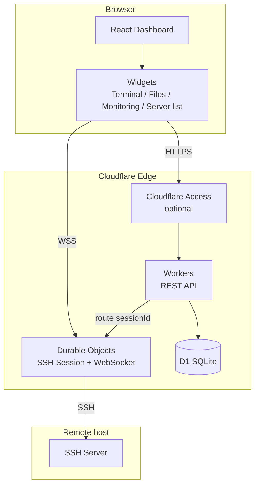
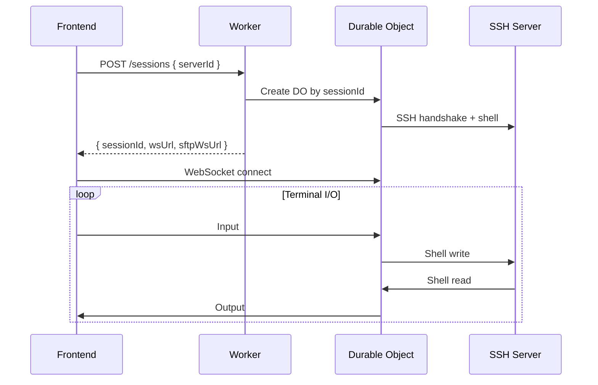

<p align="center">
  
</p>

<h1 align="center">ternssh</h1>

<p align="center">
  Multi-user SSH workspace on Cloudflare<br />
  Draggable dashboard · Terminal · SFTP · Status monitoring
</p>

<p align="center">
  <a href="LICENSE">GPL-3.0-or-later</a>
  ·
  <a href="README.md">中文</a>
</p>

<p align="center">
  <a href="https://deploy.workers.cloudflare.com/?url=https://github.com/HaradaKashiwa/ternssh">
    
  </a>
</p>

<p align="center">
  <a href="https://raw.githubusercontent.com/HaradaKashiwa/ternssh/refs/heads/main/docs/preview.png">
    
  </a>
</p>

---

## Overview

**ternssh** is an SSH management tool that runs on Cloudflare Edge. Users build their own SSH workspace with draggable dashboard widgets—server list, terminal, file manager, status monitoring, and more.

- **Open mode**: No login required; ideal for local or private-network deployments
- **Access mode**: Cloudflare Access integration with per-user data isolation

## Features

| Category | Capabilities |
|----------|--------------|
| **Server management** | Grouped tree, drag-and-drop ordering, copy/edit, password and private-key auth |
| **Terminal** | xterm.js + WebSocket; multi-tab terminals per server; command suggestions and history |
| **File manager** | SFTP browse, upload/download, drag-and-drop upload, directory ops; double-click or right-click to edit remote files (CodeMirror syntax highlighting, 2 MB max) |
| **Monitoring** | CPU / memory / disk (Status), network bandwidth (Network), process list (Process) |
| **Quick commands** | Preset and custom commands for the current terminal or all sessions |
| **Credential vault** | Saved passwords / private keys in D1; reuse when adding servers |
| **Dashboard** | Grid drag-and-drop layout with persistent widget size and position |
| **Personalization** | Light / dark / system theme, background image, widget opacity, layout spacing, terminal colors |
| **Internationalization** | 中文 / English |
| **Site settings** | Custom site name (header and browser title) |
| **Reset all** | Restore local preferences and reset database (servers, credentials, layout, etc.) |

## Tech Stack

| Layer | Technology | Notes |
|-------|------------|-------|
| Frontend | React + Vite + Tailwind + CodeMirror | Static assets served same-origin by Workers; file editing uses CodeMirror 6 |
| Backend | Cloudflare Workers | REST API, routing, identity resolution |
| Real-time | Durable Objects | One DO instance per SSH session; WebSocket long connections |
| SSH protocol | Custom TypeScript stack | Handshake, shell, SFTP, remote command execution |
| Database | Cloudflare D1 | Users, servers, layout, credentials, sessions, etc. |
| Auth (optional) | Cloudflare Access | Edge JWT validation; users isolated by email |
| DNS | Cloudflare 1.1.1.1 DoH | Hostname resolution (skipped for direct IP) |

## Quick Start

### Requirements

- Node.js 20+
- [Wrangler CLI](https://developers.cloudflare.com/workers/wrangler/)

### Local development

```bash
git clone https://github.com/HaradaKashiwa/ternssh.git
cd ternssh
npm install

# Apply D1 migrations (required on first run)
npm run db:migrate:local

# Option A: Split frontend/backend (hot reload)
npm run dev:server   # Workers + static assets, default http://localhost:8787
npm run dev:web      # Vite dev server, proxies /api

# Option B: Integrated preview closer to production
npm run build
npm run dev:server
```

### Deploy

```bash
npm run deploy
# Equivalent to: build frontend → remote D1 migrate → wrangler deploy
```

| Component | Platform |
|-----------|----------|
| API + frontend | Cloudflare Workers (`server/public/` is the Vite output) |
| Database | Cloudflare D1 |
| SSH sessions | Durable Objects (`SshSession`) |
| Auth (optional) | Cloudflare Access |

**Open mode**: `ACCESS_ENABLED=false`, access directly.

**Access mode**: Create a Self-hosted Application in Zero Trust; set `ACCESS_ENABLED=true`, `ACCESS_TEAM_DOMAIN`, and `ACCESS_AUD`.

### Docker (self-hosted)

ternssh is built on the Cloudflare Workers runtime. The Docker image runs the full app (API + frontend + local D1 + Durable Objects) via **Wrangler local mode**—suitable for private self-hosting or quick trials, **not equivalent** to Cloudflare edge production deployment.

Official images are hosted on [GitHub Container Registry](https://github.com/HaradaKashiwa/ternssh/pkgs/container/ternssh). Pushing a `v*` tag (e.g. `v1.0.0`) triggers a build and publish to `ghcr.io/haradakashiwa/ternssh`.

#### Pre-built image (recommended)

```bash
# Pull latest
docker pull ghcr.io/haradakashiwa/ternssh:latest

# Run
docker run -d \
  --name ternssh \
  -p 8787:8787 \
  -v ternssh-data:/app/.wrangler \
  --restart unless-stopped \
  ghcr.io/haradakashiwa/ternssh:latest

# Open
open http://localhost:8787
```

Pin a version (strip the `v` prefix; tag `v1.0.0` → image `1.0.0`):

```bash
docker run -d \
  --name ternssh \
  -p 8787:8787 \
  -v ternssh-data:/app/.wrangler \
  ghcr.io/haradakashiwa/ternssh:1.0.0
```

Docker Compose:

```bash
# Default latest
docker compose -f docker-compose.ghcr.yml up -d

# Pin version
TERNSSH_TAG=1.0.0 docker compose -f docker-compose.ghcr.yml up -d

# Custom port
PORT=8080 docker compose -f docker-compose.ghcr.yml up -d
```

#### Build from source

```bash
# Build and start
docker compose up -d --build

# Open
open http://localhost:8787
```

Docker CLI only:

```bash
docker build -t ternssh .
docker run -d \
  --name ternssh \
  -p 8787:8787 \
  -v ternssh-data:/app/.wrangler \
  ternssh
```

| Item | Notes |
|------|-------|
| Image | `ghcr.io/haradakashiwa/ternssh` (`:latest` / `:1.0.0` / `:1.0` / `:1`) |
| Default port | `8787` (override with `PORT`) |
| Persistence | Volume `/app/.wrangler` (local D1 and DO state) |
| Health check | `GET /api/health` |
| Auth | Open mode by default in container; Access requires extra Workers env vars |
| Publish trigger | Push Git tag `v*` → [docker-publish.yml](.github/workflows/docker-publish.yml) publishes to GHCR |

> For global edge, managed D1, and Access integration in production, deploy to Cloudflare with `npm run deploy`.

## Project Structure

```
ternssh/
├── web/                    # Frontend (React + Vite)
│   ├── public/logo.png     # Project logo (favicon / header)
│   └── src/
│       ├── components/     # UI, settings, credential fields, CodeEditor
│       ├── dashboard/      # Grid layout, dialogs
│       ├── widgets/        # Terminal, file manager, monitoring widgets
│       ├── i18n/           # Chinese / English
│       ├── lib/            # API client, sessions, SFTP
│       └── theme/          # Theme and personalization
├── server/                 # Cloudflare Workers backend
│   ├── src/
│   │   ├── routes/         # HTTP routes
│   │   ├── do/             # Durable Objects (SSH sessions)
│   │   ├── db/             # D1 queries
│   │   ├── ssh/            # SSH / SFTP protocol implementation
│   │   └── auth/           # Access JWT / default user
│   └── migrations/         # D1 database migrations
└── wrangler.jsonc          # Workers / D1 / DO config
```

## Architecture



### Authentication modes

| Mode | Condition | Behavior |
|------|-----------|----------|
| **Open mode** | `ACCESS_ENABLED=false` | No login; data belongs to built-in user `default` |
| **Access mode** | Cloudflare Access configured | Edge JWT validation; users auto-created and isolated by email |

### Responsibilities

**Workers (stateless)** — Identity resolution, CRUD, session creation and routing to DO

**Durable Objects (stateful)** — SSH connection, shell channel, SFTP, status collection WebSocket

**D1 (persistent)** — Users, servers, groups, credentials, layout, session records, credential vault

## Dashboard Widgets

| Widget | Description |
|--------|-------------|
| `server_list` | Group tree, connect/disconnect, search, drag-and-drop ordering |
| `terminal` | Multi-tab terminal, command suggestions (Tab / ↑↓) |
| `file_manager` | SFTP browse and transfer; double-click or right-click **Edit** to open the code editor with syntax highlighting and Ctrl/Cmd+S save |
| `status` | CPU, memory, disk, uptime |
| `network` | NIC traffic and bandwidth charts |
| `process` | Top processes (CPU / memory) |
| `quick_commands` | Quick commands (current terminal / all sessions) |

Default layout: server list + terminal + file manager (three columns).

### File editing

The file manager widget supports temporary in-browser editing of remote text files:

- **Open**: Double-click a file, or choose **Edit** from the context menu
- **Editor**: CodeMirror 6 with line numbers, syntax highlighting, bracket matching, code folding
- **Language detection**: Auto-matched by extension (e.g. `.js`, `.ts`, `.py`, `.json`, `.yaml`, `.sh`)
- **Save**: Toolbar save button or `Ctrl/Cmd + S`; content is written back via SFTP
- **Limits**: Regular files only, 2 MB max; unsaved changes prompt on close

## API Overview

| Method | Path | Description |
|--------|------|-------------|
| GET | `/api/v1/me` | Current user and auth mode |
| POST | `/api/v1/me/reset` | Clear user data and reset layout |
| GET/PUT | `/api/v1/dashboards` | Dashboard and widget layout |
| POST | `/api/v1/dashboards/reset` | Same database reset as `/me/reset` |
| GET | `/api/v1/servers/tree` | Server group tree |
| CRUD | `/api/v1/servers` | Server management |
| CRUD | `/api/v1/servers/groups` | Group management |
| PUT | `/api/v1/servers/move` | Drag-and-drop ordering |
| GET/POST/DELETE | `/api/v1/saved-passwords` | Saved password vault |
| GET/POST/DELETE | `/api/v1/saved-private-keys` | Saved private-key vault |
| POST | `/api/v1/sessions` | Create SSH session |
| WS | `/api/v1/sessions/:id/ws` | Terminal WebSocket |
| WS | `/api/v1/sessions/:id/sftp/ws` | SFTP WebSocket |
| GET | `/api/v1/sessions/:id/status` | Remote host metrics collection |

### SSH session lifecycle



## Database (D1)

Migrations live in `server/migrations/`:

| Migration | Contents |
|-----------|----------|
| `0001_init.sql` | users, servers, credentials, dashboards, widgets, sessions |
| `0002_server_groups.sql` | server_groups; servers add group_id / sort_order |
| `0003_saved_passwords.sql` | saved_passwords credential vault |
| `0004_saved_private_keys.sql` | saved_private_keys credential vault |

```bash
npm run db:migrate:local   # Local
npm run db:migrate         # Remote (included in deploy)
```

## Settings & Personalization

Configure in the header **Settings**:

- **General**: Site name, language, reset all settings (double confirmation)
- **Personalization**: Theme, background image, widget opacity, layout spacing, terminal colors

Reset all clears localStorage preferences and calls `POST /api/v1/me/reset` to wipe the user's servers, credentials, sessions, and layout in D1, restoring the initial state.

## Security

- **Open mode** has no application-layer authentication—do not expose sensitive environments on the public internet
- **Access mode** scopes all D1 queries with `user_id`
- SSH passwords/keys are stored in D1 `credentials` (per server); vault entries in `saved_passwords` / `saved_private_keys`
- Full-site HTTPS / WSS; DO instances isolated per session

## Configuration Reference

Example root `wrangler.jsonc`:

```jsonc
{
  "name": "ternssh",
  "main": "server/src/index.ts",
  "assets": {
    "directory": "./server/public",
    "not_found_handling": "single-page-application",
    "run_worker_first": ["/api/*"]
  },
  "d1_databases": [{
    "binding": "DB",
    "database_name": "ternssh",
    "database_id": "<your-database-id>",
    "migrations_dir": "server/migrations"
  }],
  "durable_objects": {
    "bindings": [{ "name": "SSH_SESSION", "class_name": "SshSession" }]
  },
  "migrations": [{ "tag": "v1", "new_sqlite_classes": ["SshSession"] }]
}
```

Frontend build output goes to `server/public/` (`build.outDir` in `web/vite.config.ts`).

## Roadmap

- [x] Workers + D1 scaffold, open / Access dual mode
- [x] Custom SSH protocol stack, Durable Object sessions
- [x] Dashboard drag-and-drop layout with persistence
- [x] Terminal, SFTP file manager, remote file editing, status/network/process monitoring
- [x] Server groups, credential vault, multi-tab terminals
- [x] Personalization, i18n, site name, reset all
- [ ] Multiple dashboard switching
- [ ] Pluggable custom widgets

## License

This project is licensed under the [GNU General Public License v3.0](LICENSE) (GPLv3).
