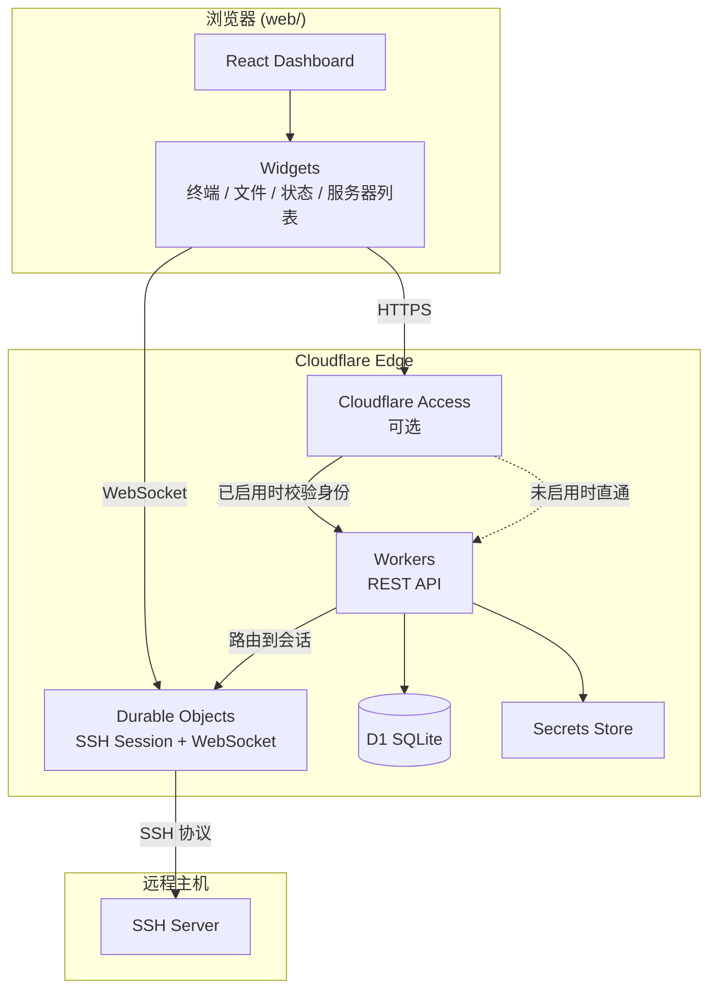
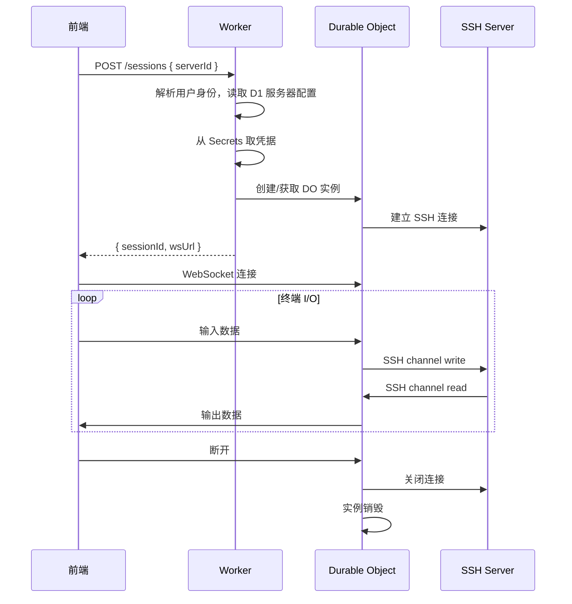
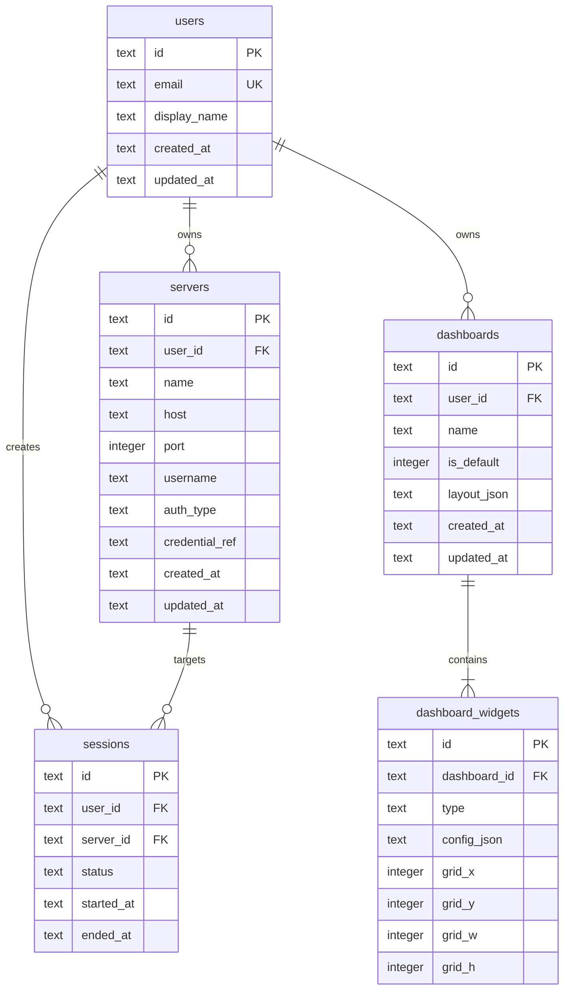

# ternssh

多用户 SSH 工具。用户通过可拖拽的仪表盘组件（服务器列表、终端、文件管理、状态监控等）构建属于自己的 SSH 工作台。

[](https://deploy.workers.cloudflare.com/?url=https://github.com/HaradaKashiwa/ternssh)

## 技术栈

| 层级 | 技术 | 说明 |
|------|------|------|
| 前端 | React + Vite + shadcn/ui | 构建为静态资源，由 Workers 同域托管 |
| 后端 | Cloudflare Workers | REST API、路由 |
| 实时连接 | Durable Objects | SSH 会话与 WebSocket 长连接 |
| 数据库 | Cloudflare D1 | 用户、服务器、布局等持久化数据 |
| 认证（可选） | Cloudflare Access | 启用时由 Access 保护应用并识别用户 |
| 密钥 | Workers Secrets / Secrets Store | SSH 私钥、凭据加密存储 |

## 项目结构

```
ternssh/
├── web/                  # 前端（React + Vite + shadcn）
│   ├── src/
│   │   ├── components/   # UI 组件
│   │   ├── dashboard/    # 仪表盘布局与拖拽引擎
│   │   ├── widgets/      # 可挂载的小部件（终端、文件管理等）
│   │   ├── hooks/        # 数据与 WebSocket hooks
│   │   └── lib/          # 工具函数、API 客户端
│   └── ...
├── server/               # 后端（Cloudflare Workers）
│   ├── src/
│   │   ├── routes/       # HTTP 路由
│   │   ├── do/           # Durable Objects（SSH 会话）
│   │   ├── db/           # D1 schema 与查询
│   │   ├── auth/         # 身份解析（Access JWT / 默认用户）
│   │   └── lib/          # 共享逻辑
│   ├── migrations/       # D1 数据库迁移
│   └── wrangler.jsonc
└── README.md
```

## 系统架构



### 认证模式

ternssh 不在应用内实现登录页，认证完全由 **Cloudflare Access** 控制：

| 模式 | 条件 | 行为 |
|------|------|------|
| **开放模式** | 未配置 Cloudflare Access | 无需登录，直接进入仪表盘；所有数据归属内置的默认用户（`default`） |
| **Access 模式** | 已配置 Cloudflare Access | Access 在边缘拦截未授权请求；Workers 从 JWT 解析用户身份（email），按用户隔离数据 |

Workers 通过环境变量 `ACCESS_ENABLED` 区分两种模式。开放模式下跳过身份校验；Access 模式下读取 `Cf-Access-Jwt-Assertion` 头，首次访问时自动在 D1 创建用户记录。

### 职责划分

**Workers（无状态）**

- 解析当前用户身份（Access JWT 或默认用户）
- CRUD：服务器配置、仪表盘布局、用户偏好
- 创建 SSH 会话时，按 `userId + serverId` 路由到对应 Durable Object
- 不直接持有 SSH 连接

**Durable Objects（有状态）**

- 每个活跃 SSH 会话对应一个 DO 实例
- 维护与远程主机的 SSH 连接（基于 `ssh2` 或等价库）
- 通过 WebSocket 向前端推送终端 I/O、文件传输进度
- 会话断开或超时后销毁实例

**D1（持久化）**

- 存储所有需要跨请求、跨会话保留的关系型数据
- 不存储 SSH 私钥明文（仅存引用 ID，实际密钥在 Secrets Store）

## 前端架构

### 仪表盘布局

采用网格拖拽布局（如 `react-grid-layout`），用户可：

- 添加、删除、调整小部件大小与位置
- 保存布局到 D1，刷新后自动恢复
- 为不同场景创建多套布局（如「运维」「开发」）

### 小部件（Widgets）

| 小部件 | 功能 |
|--------|------|
| **ServerList** | 展示已保存的服务器，一键连接 |
| **Terminal** | xterm.js 终端，经 WebSocket 与 DO 通信 |
| **FileManager** | SFTP 浏览、上传、下载、重命名 |
| **Status** | CPU、内存、磁盘、网络等实时指标 |
| **Custom** | 预留扩展点，后续可插件化 |

每个小部件通过统一的 `WidgetProps` 接口获取上下文（当前用户、选中服务器、会话 ID）。

### 数据流

```
用户操作 → React 组件 → API Client (fetch) → Workers → D1
终端输入 → WebSocket → Durable Object → SSH → 远程主机
远程输出 → SSH → Durable Object → WebSocket → xterm.js
```

## 后端架构

### API 分层

```
Request
  → 中间件（CORS、Identity、Rate Limit）
  → Router（/api/v1/...）
  → Handler（业务逻辑）
  → D1 / DO / Secrets
  → Response
```

Identity 中间件：Access 模式下校验 JWT 并注入 `userId`；开放模式下注入默认用户 `default`。

### 路由规划（草案）

| 方法 | 路径 | 说明 |
|------|------|------|
| GET | `/api/v1/me` | 返回当前用户（Access 模式）或默认用户（开放模式） |
| GET/POST/PUT/DELETE | `/api/v1/servers` | 服务器 CRUD |
| GET/PUT | `/api/v1/dashboards` | 仪表盘布局 |
| POST | `/api/v1/sessions` | 创建 SSH 会话，返回 WebSocket URL |
| WS | `/api/v1/sessions/:id/ws` | 终端 / 文件通道 |

### SSH 会话生命周期



## 数据库设计（D1）

D1 使用 SQLite 语法，通过 `wrangler d1 migrations` 管理 schema。

### ER 关系



### 表说明

**users** — 用户记录；开放模式下仅存在 `id = 'default'` 的单条记录，Access 模式下按 Access JWT 中的 email 自动创建

**servers** — SSH 服务器配置；`credential_ref` 指向 Secrets Store 中的密钥/密码，`auth_type` 为 `password` | `private_key`

**dashboards** — 仪表盘；`layout_json` 存 react-grid-layout 的全局布局快照

**dashboard_widgets** — 小部件实例；`type` 为 `terminal` | `file_manager` | `server_list` | `status` 等，`config_json` 存小部件级配置（如绑定的 serverId）

**sessions** — SSH 会话审计记录；`status` 为 `active` | `closed` | `error`

### 迁移示例

```sql
-- migrations/0001_init.sql

CREATE TABLE users (
  id           TEXT PRIMARY KEY,
  email        TEXT UNIQUE,
  display_name TEXT,
  created_at   TEXT NOT NULL DEFAULT (datetime('now')),
  updated_at   TEXT NOT NULL DEFAULT (datetime('now'))
);

-- 开放模式默认用户
INSERT INTO users (id, email, display_name) VALUES ('default', NULL, 'Default');

CREATE TABLE servers (
  id             TEXT PRIMARY KEY,
  user_id        TEXT NOT NULL REFERENCES users(id) ON DELETE CASCADE,
  name           TEXT NOT NULL,
  host           TEXT NOT NULL,
  port           INTEGER NOT NULL DEFAULT 22,
  username       TEXT NOT NULL,
  auth_type      TEXT NOT NULL CHECK (auth_type IN ('password', 'private_key')),
  credential_ref TEXT NOT NULL,
  created_at     TEXT NOT NULL DEFAULT (datetime('now')),
  updated_at     TEXT NOT NULL DEFAULT (datetime('now'))
);

CREATE INDEX idx_servers_user_id ON servers(user_id);

CREATE TABLE dashboards (
  id          TEXT PRIMARY KEY,
  user_id     TEXT NOT NULL REFERENCES users(id) ON DELETE CASCADE,
  name        TEXT NOT NULL,
  is_default  INTEGER NOT NULL DEFAULT 0,
  layout_json TEXT,
  created_at  TEXT NOT NULL DEFAULT (datetime('now')),
  updated_at  TEXT NOT NULL DEFAULT (datetime('now'))
);

CREATE INDEX idx_dashboards_user_id ON dashboards(user_id);

CREATE TABLE dashboard_widgets (
  id           TEXT PRIMARY KEY,
  dashboard_id TEXT NOT NULL REFERENCES dashboards(id) ON DELETE CASCADE,
  type         TEXT NOT NULL,
  config_json  TEXT,
  grid_x       INTEGER NOT NULL DEFAULT 0,
  grid_y       INTEGER NOT NULL DEFAULT 0,
  grid_w       INTEGER NOT NULL DEFAULT 4,
  grid_h       INTEGER NOT NULL DEFAULT 3
);

CREATE INDEX idx_widgets_dashboard_id ON dashboard_widgets(dashboard_id);

CREATE TABLE sessions (
  id         TEXT PRIMARY KEY,
  user_id    TEXT NOT NULL REFERENCES users(id) ON DELETE CASCADE,
  server_id  TEXT NOT NULL REFERENCES servers(id) ON DELETE CASCADE,
  status     TEXT NOT NULL DEFAULT 'active',
  started_at TEXT NOT NULL DEFAULT (datetime('now')),
  ended_at   TEXT
);

CREATE INDEX idx_sessions_user_id ON sessions(user_id);
```

## 安全设计

- **认证**：
  - **开放模式**：无应用层认证，适合个人内网或受信任环境部署；部署前需明确接受此风险
  - **Access 模式**：Cloudflare Access 在边缘完成身份验证（Google、GitHub、邮箱 OTP 等）；Workers 验证 `Cf-Access-Jwt-Assertion` 并提取用户 email
- **授权**：Access 模式下所有 D1 查询带 `user_id` 条件，确保多用户隔离；开放模式下所有数据归属 `default` 用户
- **凭据**：SSH 私钥/密码仅存 Secrets Store，D1 只存 `credential_ref`
- **传输**：全站 HTTPS；WebSocket 使用 WSS
- **会话**：DO 实例绑定 `userId`；Access 模式下 WebSocket 握手时校验 Access JWT
- **限流**：Workers 层按 IP / 用户限流，防止暴力连接

## 部署

### 一键部署

[](https://deploy.workers.cloudflare.com/?url=https://github.com/HaradaKashiwa/ternssh)

点击按钮会克隆仓库、构建 `web/` 静态前端到 `server/public/`，并部署 Workers（含 D1、Durable Objects 与静态资源）。`/api/*` 由 Worker 处理，其余路由回退到 SPA。

### 手动部署

```bash
npm install
npm run deploy          # 构建 web → server/public，再 wrangler deploy
npm run db:migrate --prefix server   # 首次或 schema 变更后
```

| 组件 | 平台 | 说明 |
|------|------|------|
| 应用（API + 前端） | Cloudflare Workers | `server/public/` 为 Vite 构建产物 |
| 数据库 | Cloudflare D1 | `wrangler d1 migrations apply` |
| 认证（可选） | Cloudflare Access | Zero Trust 控制台配置 Application Policy |

本地开发仍可使用前后端分离模式：

```bash
npm run dev:server   # Workers API，:8787
npm run dev:web      # Vite 开发服务器，代理 /api
```

集成预览（与生产相同，需先构建前端）：

```bash
npm run build
npm run dev:server
```

**开放模式**：不配置 Access，设置 `ACCESS_ENABLED=false`，直接访问即可。

**Access 模式**：在 Zero Trust 中为应用域名创建 Self-hosted Application，设置 `ACCESS_ENABLED=true` 并配置 `ACCESS_TEAM_DOMAIN` 与 `ACCESS_AUD`（Application AUD tag）。

`wrangler.jsonc` 中需绑定 D1、Durable Objects、静态资源与 Secrets：

```jsonc
{
  "name": "ternssh-api",
  "main": "src/index.ts",
  "compatibility_date": "2024-11-01",
  "assets": {
    "directory": "./public",
    "not_found_handling": "single-page-application",
    "run_worker_first": ["/api/*"]
  },
  "d1_databases": [
    { "binding": "DB", "database_name": "ternssh", "database_id": "<id>" }
  ],
  "durable_objects": {
    "bindings": [{ "name": "SSH_SESSION", "class_name": "SshSession" }]
  },
  "migrations": [{ "tag": "v1", "new_sqlite_classes": ["SshSession"] }]
}
```

前端构建产物输出到 `server/public/`（由 `web/vite.config.ts` 的 `build.outDir` 配置）。

## 开发路线

1. **Phase 1 — 基础**：Workers 脚手架、D1 迁移、Identity 中间件（开放 / Access 双模式）、服务器 CRUD
2. **Phase 2 — 连接**：Durable Object SSH 会话、终端小部件
3. **Phase 3 — 仪表盘**：拖拽布局、布局持久化、多小部件
4. **Phase 4 — 扩展**：文件管理、状态监控、多仪表盘

## License

This project is licensed under the [GNU General Public License v3.0](LICENSE) (GPLv3).
